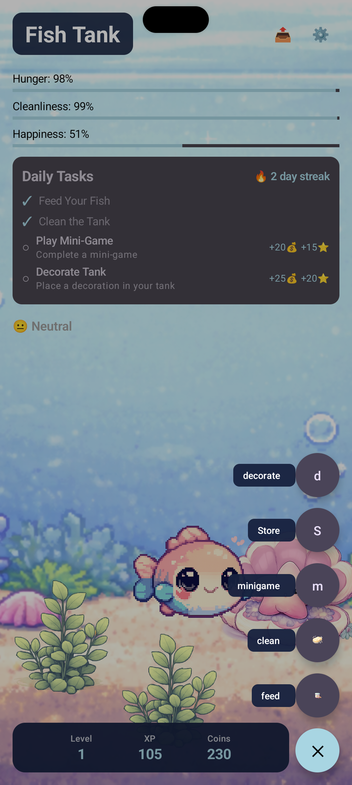
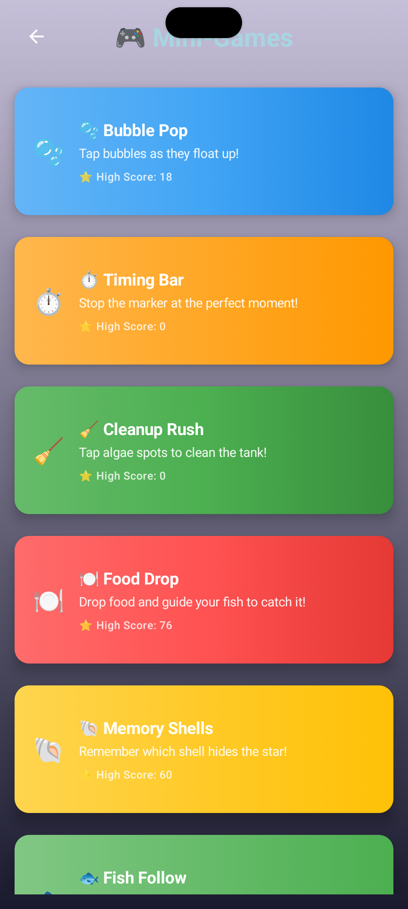

# Pixel Fish Tank 🐠

A cozy Android virtual pet game where players care for a cute pixel-art fish by feeding it, cleaning its tank, playing mini-games, and decorating its environment as the fish grows and levels up.

## 📱 About

Pixel Fish Tank is a Tamagotchi-style virtual pet game for Android. Take care of your fish by feeding it, keeping its tank clean, playing mini-games to earn coins, and decorating the tank to make your fish happy. Watch as your fish grows and levels up through your care!

## 🎬 Promo Video

Watch Pixel Fish Tank in action! See all the features, gameplay, and adorable pixel-art fish:

<div align="center">
  
[](https://youtu.be/XK6H-mTGFZg)

</div>

## 📸 Screenshots

<div align="center">

### 🎮 Gameplay Screens

<table>
  <tr>
    <td align="center" width="50%">
      <strong>Main Menu</strong><br/>
      
    </td>
    <td align="center" width="50%">
      <strong>Tank View</strong><br/>
      
    </td>
  </tr>
  <tr>
    <td align="center" width="50%">
      <strong>Mini-Games</strong><br/>
      
    </td>
    <td align="center" width="50%">
      <strong>Decoration Store</strong><br/>
      
    </td>
  </tr>
  <tr>
    <td align="center" width="50%">
      <strong>Store View</strong><br/>
      
    </td>
    <td align="center" width="50%">
      <strong>Home Screen Widgets</strong><br/>
      
    </td>
  </tr>
</table>

### ⚙️ Settings

<table>
  <tr>
    <td align="center" width="50%">
      
    </td>
    <td align="center" width="50%">
      
    </td>
  </tr>
</table>

</div>

## ✨ Features

### Core Gameplay
- **Virtual Fish System**: Manage your fish's hunger, cleanliness, happiness, level, and XP
- **Unlimited Leveling System**: Progressive XP requirements with unlimited levels - each level requires more XP than the last
  - Level 1 → 2: 100 XP
  - Level 2 → 3: 300 XP total (200 more)
  - Level 3 → 4: 600 XP total (300 more)
  - Level 4 → 5: 1,000 XP total (400 more)
  - And so on, with no level cap!
- **Tank Interaction**: Feed your fish and clean its tank to keep it healthy
- **Mini-Games**: Three engaging mini-games (Timing Bar Challenge, Bubble Pop, Cleanup Rush) with difficulty levels
- **Decoration System**: Customize your tank with various decorations
- **Daily Tasks**: Complete daily tasks to maintain streaks and earn rewards
- **Backup & Restore**: Export and import your game progress with JSON validation
- **Offline-First**: Fully playable without an internet connection

### Home Screen Widgets
- **Small Fish Status Widget (2x1)**: Quick fish status with mood, hunger bar, level & coins
- **Medium Fish Status Widget (3x2)**: Detailed view with all three stat progress bars
- **Streak Counter Widget (2x2)**: Fire emoji with current streak and best streak record
- **Daily Tasks Widget (4x3)**: Task checklist with completion status and dynamic messages
- Beautiful pastel gradient backgrounds with color-coded progress bars
- Real-time updates when game state changes
- All widgets clickable to open the app

### Technical Features
- Built with **Jetpack Compose** for modern UI
- Uses **DataStore** for local data persistence
- **Firebase** integration for crash reporting, analytics, and messaging
  - Comprehensive analytics tracking for user interactions and gameplay patterns
  - Event tracking for game actions, mini-games, progression, and app usage
- Material Design 3 theming
- Traditional RemoteViews for enhanced widget design
- Smooth animations and pixel-art graphics
- High score tracking for all mini-games

## 🎮 Getting Started

### Prerequisites
- Android Studio Hedgehog (2023.1.1) or later
- Android SDK 24 (Android 7.0) or higher
- JDK 17 or higher
- Kotlin 1.9+

### Installation

1. Clone the repository:
```bash
git clone http://10.0.0.129:3000/charles/Pixel-Fish-Tank.git
cd Pixel-Fish-Tank
```

2. Open the project in Android Studio

3. Add your `google-services.json` file:
   - Get your Firebase configuration file from the Firebase Console
   - Place it in `app/google-services.json`
   - Note: This file is gitignored for security reasons

4. Sync Gradle files and build the project

5. Run on an emulator or physical device

### Building

```bash
./gradlew assembleDebug    # Build debug APK
./gradlew assembleRelease   # Build release APK
```

## 📁 Project Structure

```
Virtual_Pet/
├── app/
│   ├── src/main/
│   │   ├── java/com/charles/virtualpet/fishtank/
│   │   │   ├── data/          # Data layer (repositories, stores)
│   │   │   ├── domain/         # Business logic (ViewModels, models)
│   │   │   ├── ui/             # UI components and screens
│   │   │   └── MainActivity.kt
│   │   ├── res/                # Resources (drawables, values)
│   │   └── AndroidManifest.xml
│   ├── build.gradle.kts
│   └── google-services.json    # Firebase config (not in repo)
├── assets/                     # Game assets (images, sprites)
├── build.gradle.kts
├── settings.gradle.kts
└── PRP.md                      # Product Requirements Document
```

## 🛠️ Technology Stack

- **Language**: Kotlin
- **UI Framework**: Jetpack Compose
- **Architecture**: MVVM (Model-View-ViewModel)
- **Dependency Injection**: Manual (Factory pattern)
- **Data Persistence**: DataStore Preferences
- **Navigation**: Navigation Compose
- **Firebase**: Crashlytics, Analytics, Messaging, Performance
- **Build System**: Gradle with Kotlin DSL

## 📊 Architecture

The app follows MVVM architecture:

- **Data Layer**: `GameStateRepository`, `DecorationStore` - Handle data persistence
- **Domain Layer**: `GameViewModel`, `MoodCalculator`, `StatDecayCalculator` - Business logic
- **UI Layer**: Compose screens and components - Presentation

## 🎨 Design

- **Art Style**: Pixel art with cozy, chibi-style fish
- **Theme**: Material Design 3
- **Color Palette**: Aquarium-inspired blues and greens
- **Animations**: Smooth, gentle animations for a relaxing experience

## 📝 Development

### Code Style
- Follow Kotlin coding conventions
- Use meaningful variable and function names
- Add comments for complex logic
- Keep functions focused and single-purpose

### Testing
```bash
./gradlew test              # Run unit tests
./gradlew connectedAndroidTest  # Run instrumented tests
```

## 🤝 Contributing

See [CONTRIBUTING.md](CONTRIBUTING.md) for guidelines on how to contribute to this project.

## 📄 License

See [LICENSE](LICENSE) for license information.

## 🔒 Privacy

See [PRIVACY_POLICY.md](PRIVACY_POLICY.md) for our privacy policy.

## 📚 Documentation

- [Product Requirements Document](PRP.md) - Detailed product specifications
- [Changelog](CHANGELOG.md) - Version history and changes

## 🐛 Known Issues

Check the issue tracker for known bugs and planned features.

## 🗺️ Roadmap

### v1.1 (Current)
- ✅ Beautiful home screen widgets (4 types)
- ✅ Three mini-games with difficulty levels
- ✅ Backup & restore functionality
- ✅ Enhanced widget system with RemoteViews
- ✅ High score tracking
- ✅ Unlimited levels with progressive XP requirements
- ✅ Firebase Analytics integration with comprehensive event tracking

### v1.0
- ✅ Core fish care mechanics
- ✅ Decoration system
- ✅ Daily tasks and streaks
- ✅ Firebase integration

### Future Features
- Screenshot sharing
- Additional fish species
- More mini-games
- Multiple tanks
- iOS version

## 👤 Author

**Charles**

## 🙏 Acknowledgments

- Inspired by classic Tamagotchi virtual pet games
- Built with love for cozy, relaxing gameplay experiences

---

Made with ❤️ for virtual pet enthusiasts

